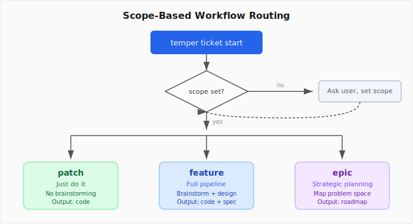
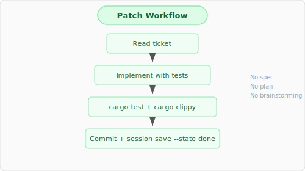
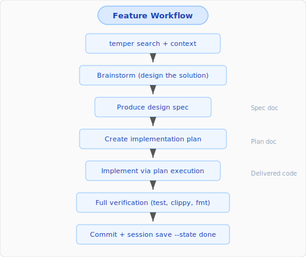
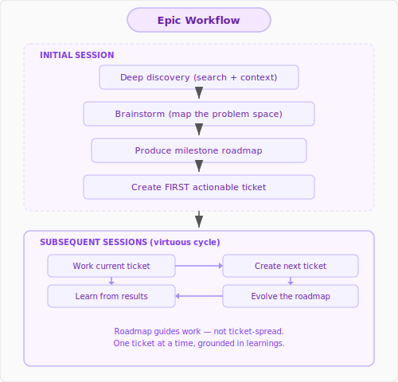

# Temper

Developer workflow tool for agent-assisted development. Semantic search across projects, session-based checkpointing, local ticket/milestone tracking, and Claude Code skill generation — all backed by a markdown vault with YAML frontmatter.

## Installation

```bash
cargo install temper-cli
```

Or build from source:

```bash
git clone https://github.com/tasker-systems/temper.git
cd temper
cargo install --path .
```

## Quick Start

```bash
# Initialize a vault
temper init ~/vaults/work

# Add your projects
temper project add --name myapp --path ~/projects/myapp

# Build the search index (downloads embedding model on first run)
temper index

# Search across all indexed content
temper search "error handling patterns"

# Create a milestone and ticket
temper milestone create --title "v0.1" --project myapp
temper ticket create --title "Add authentication" --project myapp --scope feature

# Save a session note
temper session save "Implemented auth flow"

# Generate and install the Claude Code skill
temper skill install
```

## Adaptive Workflow

Temper uses a **scope** field on tickets to control how much process ceremony is applied. This makes the investment in workflow proportional to the complexity of the work.

<p align="center">
  
</p>

### Scope Levels

| Scope | Nature | Ceremony | Output |
|-------|--------|----------|--------|
| `patch` | Tactical | None — just do it | Delivered code |
| `feature` | Deliberate | Full design pipeline | Delivered code with design artifact |
| `epic` | Strategic | Deep discovery + roadmapping | Living milestone roadmap + first actionable ticket |

### Patch Workflow

Direct implementation. No spec, no plan, no brainstorming.

<p align="center">
  
</p>

### Feature Workflow

Full superpowers pipeline: brainstorm, design, plan, implement, finish.

<p align="center">
  
</p>

### Epic Workflow

Strategic planning. The output is a milestone roadmap, not delivered code. Each subsequent session works one ticket from the roadmap, learns, evolves the roadmap, and creates the next ticket.

<p align="center">
  
</p>

## Commands

### Core

| Command | Description |
|---------|-------------|
| `temper init [path]` | Initialize a new vault |
| `temper check` | Verify vault integrity and tool health |
| `temper status` | Vault overview with index stats |
| `temper events [--project <p>]` | Show recent vault events |
| `temper warmup [--project <p>]` | Context primer for new sessions |
| `temper normalize [--project <p>]` | Repair vault structure drift |

### Search

| Command | Description |
|---------|-------------|
| `temper search <query>` | Semantic search across indexed content |
| `temper context <topic> [--depth N]` | Show topic with related context graph |
| `temper index` | Build/rebuild semantic search index |

### Notes and Sessions

| Command | Description |
|---------|-------------|
| `temper note create <type> <title>` | Create note from template |
| `temper session save [title]` | Create/update today's session note |
| `temper session list` | List recent sessions |
| `temper research save <title>` | Create high-fidelity research note |

### Tickets and Milestones

| Command | Description |
|---------|-------------|
| `temper ticket create --title <t> [--scope patch\|feature\|epic]` | Create a ticket |
| `temper ticket move <slug> [--stage <s>] [--scope <sc>]` | Move ticket stage or update scope |
| `temper ticket done <slug>` | Mark ticket as done |
| `temper ticket show <slug>` | Show ticket content |
| `temper ticket list [--project <p>]` | List tickets |
| `temper milestone create --title <t>` | Create a milestone |
| `temper milestone list` | Roadmap view |

### Projects and Skills

| Command | Description |
|---------|-------------|
| `temper project add --name <n> --path <p>` | Add project to config |
| `temper project list` | List configured projects |
| `temper skill generate` | Preview generated Claude Code skill |
| `temper skill install` | Install skill file |
| `temper skill check` | Verify skill is current |

## Ticket Lifecycle

Tickets use four stages: `backlog` → `in-progress` → `done` (or `cancelled`).

```bash
temper ticket create --title "Fix auth bug" --scope patch
temper ticket move fix-auth-bug --stage in-progress
temper ticket done fix-auth-bug --branch feat/auth --pr https://github.com/org/repo/pull/1
```

Session notes can link to tickets, optionally transitioning their stage:

```bash
temper session save "Fixed the auth bug" --ticket fix-auth-bug --state done
```

## Configuration

Temper uses `temper.toml` at the vault root:

```toml
[vault]
sessions = "sessions"
tickets = "tickets"
milestones = "milestones"
templates = "templates"
state_dir = ".temper"

[index]
include = ["docs", "notes"]
exclude = [".git", "archive"]
sources = ["~/projects/other-repo/docs"]

[embedder]
model = "all-MiniLM-L6-v2"
cache_dir = "~/.cache/temper/models"

[projects.myapp]
repo = "org/myapp"
path = "~/projects/myapp"

[skill]
output = "~/.claude/commands/temper.md"
framework = "superpowers"
```

### Vault Resolution

Temper finds your vault using this chain:

1. `--vault <path>` CLI flag
2. `TEMPER_VAULT` environment variable
3. Walk up from CWD looking for `temper.toml`
4. `~/.config/temper/config.toml` default vault

## Claude Code Integration

Temper generates a Claude Code skill file tailored to your vault:

```bash
temper skill install           # Install globally
temper skill install --project ~/projects/myapp  # Project-scoped
```

The generated skill integrates with the [superpowers](https://github.com/anthropics/claude-code-plugins) workflow and uses scope-based routing to match process intensity to task complexity.

### Session Pre-Warming

To automatically prime new Claude Code sessions with recent context, add a `SessionStart` hook to your project's `.claude/settings.local.json`:

```json
{
  "hooks": {
    "SessionStart": [{
      "matcher": "startup",
      "hooks": [{
        "type": "command",
        "command": "temper warmup --project <your-project>"
      }]
    }]
  }
}
```

This runs `temper warmup` on every new session, injecting:
- In-progress tickets with scope labels
- Last 3 session summaries
- Full content of the most recent session note
- Last 15 project events (ticket/milestone activity)

## Semantic Search

Temper embeds your vault content using all-MiniLM-L6-v2 (via Candle, no Python required) and stores vectors in an HNSW index for fast approximate nearest-neighbor search. Indexing is incremental — only changed files are re-embedded.

```bash
temper index                   # Build/update index
temper search "design patterns" --limit 5
temper context "Authentication" --depth 2
```

## License

MIT
