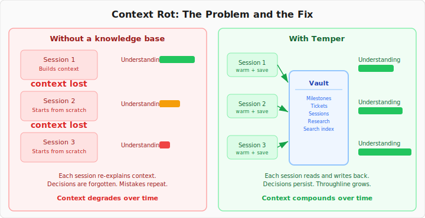

<p align="center">
  
</p>

<p align="center">
  <strong>/ˈtempər/</strong> — <em>to make stronger and more resilient through a deliberate process</em>
</p>

Temper is an **event-sourced coordination substrate** whose organizing purpose is to be economical with attention. A **cognitive map** is a telos-seeded region of that substrate where humans and agents grow a shared, situated understanding together — and everything else, personal knowledge management included, is a projection over it. Everything resolves to markdown; the system gets out of the way.

<p align="center">
  <a href="https://temperkb.io">temperkb.io</a> · <a href="https://temperkb.io/cognitive-maps">Cognitive maps</a> · <a href="https://temperkb.io/operating">Operating</a> · <a href="https://temperkb.io/theory">Theory</a>
</p>

## Substrate, and one projection over it

Temper is a coordination substrate first. The conceptual frame — what a cognitive map is, what the architecture fixes versus what a deployment shapes, and the commitments underneath — lives on the site: start with [cognitive maps](https://temperkb.io/cognitive-maps) (the concrete on-ramp), [operating](https://temperkb.io/operating) (running it, for the evaluator), and [theory](https://temperkb.io/theory) (the why).

The rest of this README is the **personal-knowledge projection** — the view a solo builder or small team uses to keep an agent's context coherent across sessions. A true and useful view, not the whole story.

## The problem it solves

AI coding agents are powerful but forgetful. Every session starts blank — no memory of yesterday's decisions, no awareness of in-flight work, no sense of what matters next. The industry calls this [context rot](https://www.understandingai.org/p/context-rot-the-emerging-challenge): the progressive degradation of an agent's understanding as work spans sessions.

<p align="center">
  
</p>

Developers compensate by re-explaining context, pasting old chat logs, and manually steering agents through decisions the agent should already know about. This tax grows with every session. The fix is **throughline** — knowing what's been done, what's up next, what's decided and what's still open.

## Throughline

In the personal-knowledge projection, goals hold the vision, tasks carry the work, and sessions record what happened. Each layer provides context for the layer below, and each session's conclusions feed back up — refining the goals, sharpening the path forward. (Underneath, each of those is an event on the substrate; the projection is one honest view of the ledger.)

<p align="center">
  
</p>

This isn't a ticketing system competing with Linear. It's a structured vault of markdown files where every goal, task, session, decision, and research thread has a home — and where the connections between them are always visible.

## Session continuity

Every new session starts with `temper warmup`, which injects active tasks, recent session summaries, and the last session's full content. The agent resumes where you left off instead of starting from scratch.

At the end of each session, a session note (`temper resource create --type session`) captures what happened — decisions made, tasks updated, next steps identified — written straight through the cloud to the substrate. The next session reads it. Context compounds instead of decaying.

<p align="center">
  
</p>

## Goals and tasks

Temper gives you two building blocks:

**Goals** are the outcomes you're working toward. A goal holds the vision and purpose of a feature, a product, a body of work. Tasks and sessions roll up to goals.

**Tasks** are units of work toward a goal. Every task has a **mode** — `build` or `plan` — and an expected **effort** — `small`, `medium`, or `large`. Your workflow preferences (set during `temper init`) shape how these translate into process — temper carries the throughline regardless of what tools and ceremonies you prefer.

## For humans and agents

Temper gives agents the same throughline that humans carry in their heads: what we're building, why, what we've decided, and what's deferred. Agents reach the vault three ways:

- **CLI** — `temper warmup`, `temper search`, `temper resource create`. Claude Code hooks call `temper warmup` automatically at session start.
- **MCP Server** — vault operations exposed as structured tools. Agents query, read, and write through the Model Context Protocol.
- **Skill File** — `temper skill install` generates a Claude Code skill that teaches the agent your vault's structure and workflow conventions.

If it can read files, it can use temper.

## Install

The fastest way to try temper is the one-liner installer — no Rust toolchain needed.

**macOS (Apple Silicon) and Linux (x86_64):**

```bash
curl -fsSL https://raw.githubusercontent.com/tasker-systems/temper/main/scripts/install/install.sh | sh
```

**Windows (x86_64, PowerShell):**

```powershell
irm https://raw.githubusercontent.com/tasker-systems/temper/main/scripts/install/install.ps1 | iex
```

> Windows support is experimental in v0.1.x — please file issues at
> https://github.com/tasker-systems/temper/issues if you hit problems.

For version pinning, uninstall instructions, and building from source (including Linux arm64 and Intel Mac), see [docs/guides/install.md](docs/guides/install.md).

## Quick Start

```bash
# Initialize — temper configures auth and ensures your default context server-side
temper init

# Add a context for your project
temper context add myapp

# Materialize a local projection of the context
temper pull myapp

# Add a document — temper extracts markdown and ingests it via the cloud pipeline
temper resource create --from ~/projects/myapp/docs/design.md --context myapp

# Search across your vault
temper search "authentication decisions"

# Generate and install the Claude Code skill
temper skill install

# Write a session note (body via --body @file or piped stdin)
temper resource create --type session --context myapp --title "Implemented auth flow, chose JWT rotation"
```

## The Vault

The vault is a directory of markdown files with YAML frontmatter. This is deliberate:

- **Human-readable.** Browse your vault in any editor, in Obsidian, or on GitHub. No proprietary formats.
- **Version-controllable.** Git tracks changes. Diffs are readable. History is auditable.
- **AI-native.** Language models understand markdown and YAML frontmatter natively. No parsing overhead.
- **Portable.** The knowledge base is the unit of value, not the tool.

## Commands

### Core

| Command | Description |
|---------|-------------|
| `temper init` | Initialize a new vault |
| `temper check` | Verify vault integrity and tool health |
| `temper status` | Vault overview |
| `temper warmup [--context <ctx>]` | Context primer for new sessions |
| `temper pull <ctx>` | Materialize a context's projection from the cloud |

### Search

| Command | Description |
|---------|-------------|
| `temper search <query>` | Hybrid full-text + semantic search |
| `temper search <query> --edge-type <k> --depth <n>` | Search with graph expansion along typed edges |

### Content

| Command | Description |
|---------|-------------|
| `temper resource create --type <t> --title <t>` | Create a resource (goal, task, session, research, decision, concept) |
| `temper resource create --from <path\|url>` | Ingest a file or URL (extract, embed, store via the cloud pipeline) |
| `temper resource list --type <t>` | List resources of a type |
| `temper resource show <ref>` | Show a resource by ref |

### Goals and Tasks

| Command | Description |
|---------|-------------|
| `temper resource create --type task --title <t> --context <ctx>` | Create a task |
| `temper resource create --type goal --title <t> --context <ctx>` | Create a goal |
| `temper resource list --type task [--context <ctx>]` | List tasks (or any doc type) |
| `temper resource update <ref> --stage done` | Mark a task done |

> `temper resource create` writes *into* a context (`--context`). `temper resource update`, `show`, and `delete` take a single **ref** — a UUID or the decorated `slug-<uuid>` form — and need no `--type`/`--context`.

### Relationships

| Command | Description |
|---------|-------------|
| `temper edge assert <source> <target> --kind <k> --polarity <p> --label <l>` | Assert a typed edge (kinds: express, contains, leads-to, near; polarity forward/inverse) |
| `temper edge reweight <edge-handle> --weight <n>` | Change an edge's weight |
| `temper edge fold <edge-handle>` | Fold (supersede) an edge |

### Contexts and Skills

| Command | Description |
|---------|-------------|
| `temper context add <n>` | Add a context |
| `temper context list` | List contexts |
| `temper skill generate` | Preview generated Claude Code skill |
| `temper skill install` | Install skill file |

### Cloud

| Command | Description |
|---------|-------------|
| `temper auth` | Authenticate with temper cloud |
| `temper pull <context>` | Materialize a local projection of a context |
| `temper resource delete <ref>` | Delete a resource from the cloud (soft-delete) |

## Semantic Search

Temper embeds your query locally with BAAI/bge-base-en-v1.5 (via ONNX Runtime, no Python required), sends the 768-dim vector to the cloud API, and returns pgvector cosine-similarity matches scoped to what you can access.

```bash
temper search "design patterns" --limit 5
```

## Claude Code Integration

Temper generates a Claude Code skill file tailored to your vault:

```bash
temper skill install
```

### Session Pre-Warming

To automatically prime new Claude Code sessions with recent context, add a `SessionStart` hook to your project's `.claude/settings.local.json`:

```json
{
  "hooks": {
    "SessionStart": [{
      "hooks": [{
        "type": "command",
        "command": "temper warmup --context myapp"
      }]
    }]
  }
}
```

This runs `temper warmup` on every new session, injecting active tasks, recent sessions, open decisions, and project events.

## Temper Cloud

The cloud is the source of truth. Resources are created and updated via the API; the local vault is a projection cache materialized on demand via `temper pull <context>`. All content is stored as markdown with YAML frontmatter and remains human-readable — browse it in any editor, Obsidian, or on GitHub.

What cloud adds:

- **Cross-machine access** — pull any context to any device with `temper pull`
- **Semantic search** powered by pgvector embeddings
- **MCP server** for direct agent integration
- **Team contexts** with granular access control
- **Self-host or use temperkb.io** — same protocol, your choice

### MCP Server

The remote MCP server exposes vault operations as structured tools over [Streamable HTTP](https://modelcontextprotocol.io/specification/2025-03-26/basic/transports#streamable-http). Agents authenticate via Auth0 using the standard OAuth 2.1 + PKCE flow — the server advertises Auth0's endpoints through RFC 8414 / RFC 9728 discovery so MCP clients handle the flow automatically.

**Available tools:**

| Tool | Description |
|------|-------------|
| `list_resources` | List resources, optionally filtered by context |
| `get_resource` | Get a resource by ID, optionally with full content |
| `create_resource` | Create a new resource in a context |
| `update_resource` | Update a resource's title, slug, or content |
| `update_resource_meta` | Update frontmatter without touching the body |
| `delete_resource` | Soft-delete a resource by ID |
| `assert_relationship` | Assert a typed edge between two resources |
| `retype_relationship` | Change an edge's kind and polarity |
| `reweight_relationship` | Change an edge's weight |
| `fold_relationship` | Fold (supersede) an edge |
| `search` | Full-text + semantic search across the knowledge base |
| `list_contexts` | List available contexts (workspaces) |
| `get_context` | Get details of a specific context |
| `create_context` | Create a new context |
| `list_doc_types` | List available document types |
| `describe_doc_type` | Describe a doc type's schema |
| `list_events` | List events, optionally filtered by resource or type |
| `get_profile` | Get the authenticated user's profile |

**Connect from Claude Desktop or Claude Code:**

```json
{
  "mcpServers": {
    "temper": {
      "url": "https://temperkb.io/mcp"
    }
  }
}
```

The client handles OAuth automatically — you'll be prompted to log in on first connection.

## Related Work

Temper draws on ideas from several projects working on adjacent problems:

- [superpowers](https://github.com/obra/superpowers) — Structured workflow stages for agent-assisted development
- [speckit](https://github.com/github/spec-kit) — Specification-driven development with AI
- [OpenSpec](https://github.com/Fission-AI/OpenSpec) — Open standard for AI-friendly project specifications
- [GSD](https://thenewstack.io/beating-the-rot-and-getting-stuff-done/) — Framework for managing context rot in agent workflows

## License

MIT
