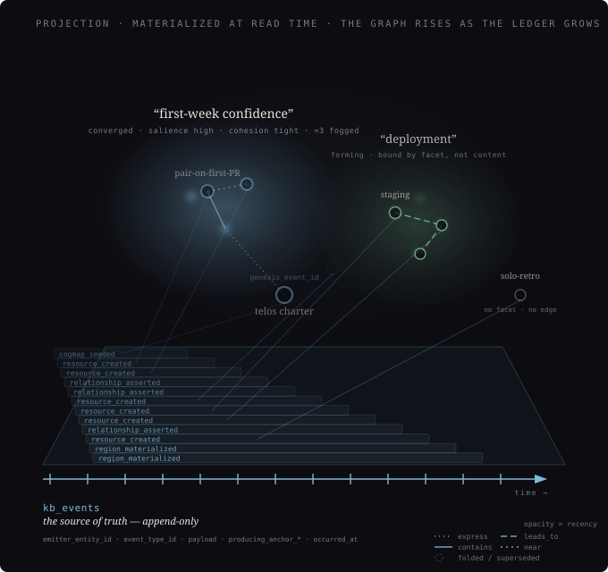
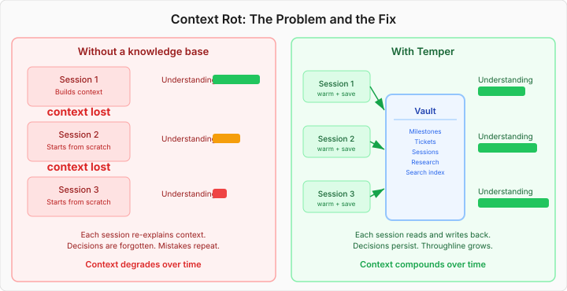
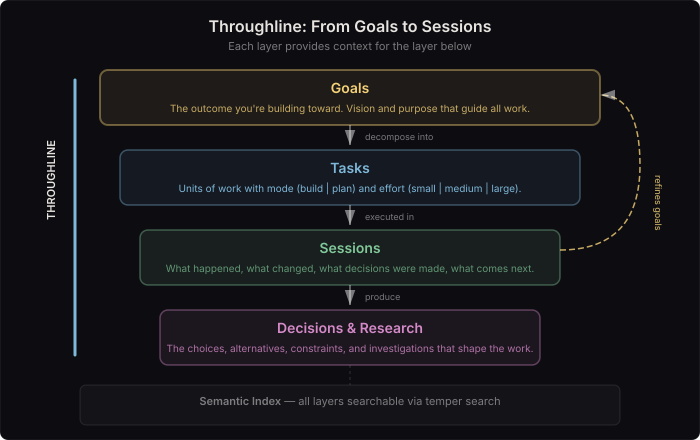
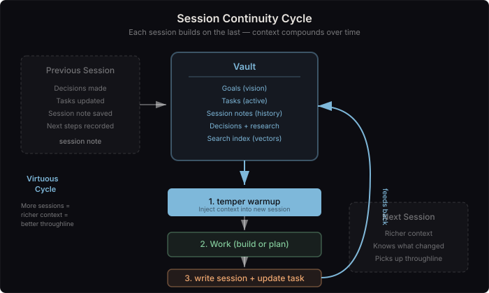

<p align="center">
  
</p>

<p align="center">
  <strong>/ˈtempər/</strong> — <em>to make stronger and more resilient through a deliberate process</em>
</p>

Temper is an **event-sourced coordination substrate** whose organizing purpose is to be economical with attention. A **cognitive map** is a telos-seeded region of that substrate where humans and agents grow a shared, situated understanding together — and everything else, personal knowledge management included, is a projection over it. Everything resolves to markdown; the system gets out of the way.

<p align="center">
  <a href="https://temperkb.io">temperkb.io</a> · <a href="https://temperkb.io/cognitive-maps">Cognitive maps</a> · <a href="https://temperkb.io/operating">Operating</a> · <a href="https://temperkb.io/theory">Theory</a>
</p>

<p align="center">
  
</p>
<p align="center"><sub>The ledger is the source of truth. Every higher surface — the graph, the regions, the personal-knowledge view — is a projection materialized at read time.</sub></p>

## Substrate, and one projection over it

Temper is a coordination substrate first. The conceptual frame — what a cognitive map is, what the architecture fixes versus what a deployment shapes, and the commitments underneath — lives on the site: start with [cognitive maps](https://temperkb.io/cognitive-maps) (the concrete on-ramp), [operating](https://temperkb.io/operating) (running it, for the evaluator), and [theory](https://temperkb.io/theory) (the why).

The rest of this README is the **personal-knowledge projection** — the view a solo builder or small team uses to keep an agent's context coherent across sessions. A true and useful view, not the whole story.

## The problem it solves

AI coding agents are powerful but forgetful. Every session starts blank — no memory of yesterday's decisions, no awareness of in-flight work, no sense of what matters next. The industry calls this [context rot](https://www.understandingai.org/p/context-rot-the-emerging-challenge): the progressive degradation of an agent's understanding as work spans sessions.

<p align="center">
  
</p>

Developers compensate by re-explaining context, pasting old chat logs, and manually steering agents through decisions the agent should already know about. This tax grows with every session. The fix is **throughline** — knowing what's been done, what's up next, what's decided and what's still open.

## Throughline

In the personal-knowledge projection, goals hold the vision, tasks carry the work, and sessions record what happened. Each layer provides context for the layer below, and each session's conclusions feed back up — refining the goals, sharpening the path forward. (Underneath, each of those is an event on the substrate; the projection is one honest view of the ledger.)

<p align="center">
  
</p>

This isn't a ticketing system competing with Linear. It's a structured knowledge base where every goal, task, session, decision, and research thread has a home — and where the connections between them are always visible.

## Session continuity

Every new session starts with `temper warmup`, which surfaces active goals, in-progress tasks, recent sessions, and pending invitations. The agent resumes where you left off instead of starting from scratch.

At the end of each session, a session note (`temper resource create --type session`) captures what happened — decisions made, tasks updated, next steps identified — written straight through the cloud to the substrate. The next session reads it. Context compounds instead of decaying.

<p align="center">
  
</p>

## Goals and tasks

Temper gives you two building blocks:

**Goals** are the outcomes you're working toward. A goal holds the vision and purpose of a feature, a product, a body of work. Tasks and sessions roll up to goals.

**Tasks** are units of work toward a goal. Every task has a **mode** — `build` or `plan` — and an expected **effort** — `small`, `medium`, or `large`. Your workflow preferences (set during `temper init`) shape how these translate into process — temper carries the throughline regardless of what tools and ceremonies you prefer.

## For humans and agents

Temper gives agents the same throughline that humans carry in their heads: what we're building, why, what we've decided, and what's deferred. Agents reach your knowledge base three ways:

- **CLI** — `temper warmup`, `temper search`, `temper resource create`. Claude Code hooks call `temper warmup` automatically at session start.
- **MCP Server** — knowledge-base operations exposed as structured tools. Agents query, read, and write through the Model Context Protocol.
- **Skill File** — `temper skill install` generates a Claude Code skill that teaches the agent your knowledge base's structure and workflow conventions.

If it can read markdown, it can use temper.

## Install

The fastest way to try temper is the one-liner installer — no Rust toolchain needed.

**macOS (Apple Silicon) and Linux (x86_64):**

```bash
curl -fsSL https://raw.githubusercontent.com/tasker-systems/temper/main/scripts/install/install.sh | sh
```

**Homebrew (macOS Apple Silicon, Linux x64):**

```sh
brew install tasker-systems/tap/temper
```

**Windows (x86_64, PowerShell):**

```powershell
irm https://raw.githubusercontent.com/tasker-systems/temper/main/scripts/install/install.ps1 | iex
```

Supported platforms: macOS (Apple Silicon), Linux (x86_64), and Windows (x86_64) — please file issues at https://github.com/tasker-systems/temper/issues if you hit problems.

For version pinning, uninstall instructions, and building from source (including Linux arm64 and Intel Mac), see the [install playbook](docs/playbooks/install-temper.md).

## Quick Start

```bash
# Initialize — temper writes your config and ensures your default context server-side
temper init

# Log in (browser OAuth, PKCE). `temper auth status` shows where you stand.
temper auth login

# Create a context for your project on the server
temper context create myapp

# Add a document — temper extracts markdown and ingests it via the cloud pipeline
temper resource create --from ~/projects/myapp/docs/design.md --context @me/myapp

# Search across your knowledge base
temper search "authentication decisions"

# Generate and install the Claude Code skill
temper skill install

# Write a session note (body via --body @file or piped stdin)
temper resource create --type session --context @me/myapp --title "Implemented auth flow, chose JWT rotation"
```

> **Addressing.** A **context** is addressed by ref — `@me/<slug>` for your own, `+<team>/<slug>` for a team's, or a bare UUID. Bare names are not addressable, so `--context myapp` is rejected. Of the commands below, only `temper context create` takes a plain name — it is naming a context, not resolving one.
>
> A **resource** is addressed by ref too — a UUID or the decorated `slug-<uuid>` form. Every resource-returning command — `create`, `update`, `list`, `show`, `search` — carries a `ref` field: copy it, paste it. A script that just created a resource can address it straight from the response.

## Everything Resolves to Markdown

A resource *is* a markdown body with YAML frontmatter, and that is the form you read it in — through `temper resource show`, an agent over MCP, or the web UI. The cloud is the source of truth, and every write routes through the API.

Markdown is deliberate:

- **Human-readable.** No proprietary formats. A resource reads the same in a terminal, in the web UI, and in an agent's context window.
- **AI-native.** Language models understand markdown and YAML frontmatter natively. No parsing overhead.
- **Portable.** The knowledge base is the unit of value, not the tool.

## Commands

The [CLI reference](docs/reference/cli/README.md) documents every command and flag, generated
from the built binary's own `--help` — if a page there disagrees with the binary in your
hands, the page is the defect. The global output flags (`--format json|toon`,
`--color auto|always|never`) and their precedence live there too. Orientation by area:

- **Core:** [`init`](docs/reference/cli/init.md), [`check`](docs/reference/cli/check.md),
  [`status`](docs/reference/cli/status.md), [`warmup`](docs/reference/cli/warmup.md)
- **Search:** [`search`](docs/reference/cli/search.md), [`graph`](docs/reference/cli/graph.md)
- **Resources:** [`resource`](docs/reference/cli/resource.md) — create, list, show, update,
  delete; and [`data-artifact`](docs/reference/cli/data-artifact.md)
- **Relationships:** [`edge`](docs/reference/cli/edge.md)
- **Cognitive maps:** [`cogmap`](docs/reference/cli/cogmap.md),
  [`invocation`](docs/reference/cli/invocation.md), [`steward`](docs/reference/cli/steward.md)
- **Contexts and skills:** [`context`](docs/reference/cli/context.md),
  [`skill`](docs/reference/cli/skill.md)
- **Cloud and auth:** [`auth`](docs/reference/cli/auth.md),
  [`invitations`](docs/reference/cli/invitations.md), [`team`](docs/reference/cli/team.md),
  [`pull`](docs/reference/cli/pull.md), [`config`](docs/reference/cli/config.md),
  [`memory`](docs/reference/cli/memory.md), [`slack`](docs/reference/cli/slack.md)
- **Admin and introspection:** [`admin`](docs/reference/cli/admin.md),
  [`query`](docs/reference/cli/query.md), [`blob`](docs/reference/cli/blob.md),
  [`trail`](docs/reference/cli/trail.md), [`version`](docs/reference/cli/version.md),
  [`update`](docs/reference/cli/update.md)

> `temper resource create` writes *into* a context (`--context`). `temper resource update`, `show`, and `delete` take a single **ref** — a UUID or the decorated `slug-<uuid>` form — and need no `--type`/`--context`.

A cognitive map is a telos-seeded region of the substrate. Nodes are *distilled* resources — a map node is never the same row as its source. Authoring into a map happens under an **invocation envelope**, so every act is correlated and auditable. The cogmap commands read in authoring order: open an envelope, create nodes and facet them, close, materialize, then read — and **regions only exist after a materialize**; an authoring pass that creates nodes but never materializes leaves the read tier unchanged.

Building one from a body of source material is its own discipline: [ingesting a corpus](docs/playbooks/ingest-a-corpus.md), then [building a cognitive map](docs/playbooks/build-a-cognitive-map.md) from it. For the concept, see [cognitive maps](https://temperkb.io/cognitive-maps).

`temper team` also carries `create`, `invite`, `show`, `set-role`, `leave`, and offboarding `reassign`. Self-hosting an instance? The [self-hosting playbook](docs/playbooks/self-host-temper.md) walks `temper init`'s instance flags.

## Semantic Search

Temper embeds your query locally with BAAI/bge-base-en-v1.5 (via ONNX Runtime, no Python required), sends the 768-dim vector to the cloud API, and returns pgvector cosine-similarity matches scoped to what you can access.

```bash
temper search "design patterns" --limit 5
```

## Claude Code Integration

Temper generates a Claude Code skill file tailored to your knowledge base:

```bash
temper skill install
```

### Session Pre-Warming

To automatically prime new Claude Code sessions with recent context, add a `SessionStart` hook to your project's `.claude/settings.local.json`:

```json
{
  "hooks": {
    "SessionStart": [{
      "hooks": [{
        "type": "command",
        "command": "temper warmup --context @me/myapp"
      }]
    }]
  }
}
```

This runs `temper warmup` on every new session, surfacing active goals, in-progress tasks, recent sessions, and pending invitations.

### Operational Memory

The working knowledge a session accumulates can live in Temper as `memory` resources instead of in one machine's directory, so it travels across machines and clients and carries the date each claim was last checked. `temper memory status` reports what a machine is carrying and works before you adopt anything — declining is a supported end state.

```bash
temper memory status
```

See [adopting operational memory](docs/playbooks/adopt-operational-memory.md) for adopting it, sharing it with a team, and the limits.

## Temper Cloud

The cloud is the source of truth. Resources are created and updated via the API. All content is stored as markdown with YAML frontmatter and remains human-readable — read it from the CLI, an agent over MCP, or the web UI.

What cloud adds:

- **Cross-machine access** — the same knowledge base from any device, no sync to manage
- **Semantic search** powered by pgvector embeddings
- **MCP server** for direct agent integration
- **Team contexts** with granular access control
- **Self-host or use temperkb.io** — same protocol, your choice

### MCP Server

The remote MCP server exposes knowledge-base operations as structured tools over [Streamable HTTP](https://modelcontextprotocol.io/specification/2025-03-26/basic/transports#streamable-http). Agents authenticate via Auth0 using the standard OAuth 2.1 + PKCE flow — the server advertises Auth0's endpoints through RFC 8414 / RFC 9728 discovery so MCP clients handle the flow automatically.

**Core tools:**

| Tool | Description |
|------|-------------|
| `search` | Full-text + semantic search across the knowledge base |
| `list_resources` | List resources, optionally filtered by context and/or doc type |
| `get_resource` | Get a resource by ref, optionally with full content |
| `create_resource` | Create a new resource in a context |
| `update_resource` | Update a resource's title, slug, or content |
| `update_resource_meta` | Update frontmatter without touching the body |
| `delete_resource` | Soft-delete a resource by ID |
| `relationship` | Assert, retype, reweight, or fold typed edges (action discriminator) |
| `context_read` / `context_manage` | Read and manage contexts (workspaces) |
| `describe_schema` | Describe doc types and their schemas |
| `run_query` | Run a composed query — a declared DAG of acts answered in one round trip |
| `element_trail` | Read a resource's or edge's append-only event trail |

The tool surface also covers cognitive maps (`cogmap_*`), blobs (`blob_*`), data artifacts (`commit_data_artifact` and friends), and facets (`facet_set` / `facets_read`) — the full list is what the server advertises over MCP, so your client's tool list is the reference.

**Connect from Claude Desktop or Claude Code:**

```json
{
  "mcpServers": {
    "temper": {
      "url": "https://temperkb.io/mcp"
    }
  }
}
```

The client handles OAuth automatically — you'll be prompted to log in on first connection.

## Development

Working from a checkout? `bin/setup.sh` provisions the full dev/admin environment —
Homebrew deps, the cargo tooling, git hooks, a Docker Postgres, and migrations — and is
idempotent, so re-running just converges:

```bash
git clone git@github.com:tasker-systems/temper.git && cd temper
bin/setup.sh                 # add --with-cli to also install the `temper` binary
cargo make check && cargo make test-db
```

See [internal/development/development.md](internal/development/development.md) for the full walk-through,
daily commands, and troubleshooting.

## Related Work

Temper draws on ideas from several projects working on adjacent problems:

- [superpowers](https://github.com/obra/superpowers) — Structured workflow stages for agent-assisted development
- [speckit](https://github.com/github/spec-kit) — Specification-driven development with AI
- [OpenSpec](https://github.com/Fission-AI/OpenSpec) — Open standard for AI-friendly project specifications
- [GSD](https://thenewstack.io/beating-the-rot-and-getting-stuff-done/) — Framework for managing context rot in agent workflows

## License

MIT
