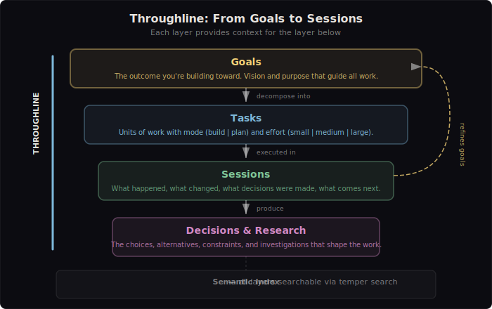
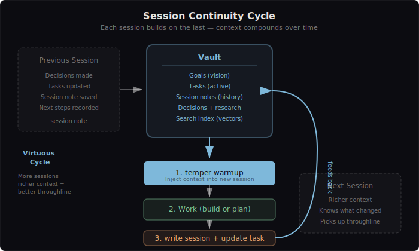
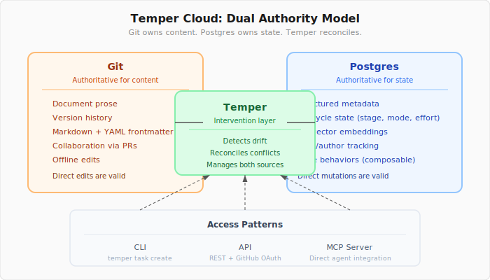

# Temper — Vision

## The Core Insight

Specification documents, plans, session notes, tickets, and milestones are only as useful as they are **coherent, evolving, organized, and findable**. What we're building, why we're building it, and what the throughline of development is — these are the questions that matter most when an agent sits down to work.

**Throughline** is the most critical aspect of what Temper aims to support. Knowing what's been done, what's up next, what decisions have been made and which are still open — this is the connective tissue that turns a collection of artifacts into a navigable development history.

It is not about elaborating sets of tickets that map to a current vision. It is about holding a high-level project vision and milestone-as-roadmap, and having each session take up a ticket, carry that ticket to execution, and leave explicit guidance on where the outcome of that work concluded — what the next session should consider, which tickets are open that relate to the work — so that context management becomes embedded in the session-over-session workflow as a virtuous cycle.

Rapid development, ideation, and delivery are facilitated by allowing creative freedom to grow and shift scope within a session, so long as that information is carried forward and the evolving decisions and revisions to documents are tracked and managed. This frees us from backlog rot — the cognitive overhead of reconciling every ticket's assumptions with a system that has evolved past them. The goal is not to spend less time on specifications and planning; if anything, we invest more. But that investment stays tracked to the overall roadmap goals while remaining nimble in the session-by-session process of developing toward them.

  

## The Problem Space

### Context Rot

[Context rot](https://www.understandingai.org/p/context-rot-the-emerging-challenge) is the progressive degradation of an agent's understanding as work spans sessions, branches, and projects. Every new session starts blank. The agent has no structured way to know what happened yesterday, what was decided last week, or what the broader trajectory of the project looks like.

Developers compensate with manual rituals: re-explaining context, pasting chat logs, writing ad-hoc notes that may or may not be found again. This tax grows with project complexity and session count.

### One-Size-Fits-All Process

Most agent workflows apply uniform process regardless of task complexity. A one-line typo fix goes through the same brainstorm-design-plan-implement pipeline as a new feature. A multi-week initiative gets the same treatment as a single-session task. The mismatch wastes time in both directions: too much overhead on simple work, too little structure on complex work.

### Scattered Knowledge

Development knowledge has no unified home that agents can read. Tickets live in GitHub, decisions live in chat history, session context evaporates when the window closes, specifications live in various docs folders with no indexing. There's no structured, portable, version-controllable source of truth that an agent can consume at session start and write back to at session end.

## The Ecosystem

Several projects are working on parts of this problem:

- **[superpowers](https://github.com/obra/superpowers)** provides structured workflow stages (brainstorm, design, plan, implement, finish) that give agents a process to follow. Temper's adaptive workflow builds on this foundation, adding scope-based routing so the right stages are applied to the right work.

- **[speckit](https://github.com/github/spec-kit)** and **[OpenSpec](https://github.com/Fission-AI/OpenSpec)** focus on specification-driven development — giving agents well-structured specs to work from. Temper shares this conviction that structured documents matter, and may integrate ideas from OpenSpec for specification management within the vault.

- **[GSD](https://thenewstack.io/beating-the-rot-and-getting-stuff-done/)** addresses the tactical side of context rot — frameworks for maintaining agent effectiveness across sessions. Temper's warmup system and session notes serve a similar purpose but embed continuity into the workflow rather than treating it as a separate concern.

Temper's contribution is the **throughline layer** that connects these concerns: a knowledge base where specifications, plans, session history, tickets, and milestones are all coherent, indexed, and wired into the agent's workflow through skills and startup hooks.

## Design Philosophy

### The Vault

The vault is a directory of markdown files with YAML frontmatter. This is a deliberate choice:

- **Human-readable and portable.** You can browse a vault in any editor, in Obsidian, or on GitHub. No proprietary formats, no required tooling to view content.
- **Version-controllable.** Git tracks changes, diffs are readable, history is auditable. The vault's history *is* the project's decision history.
- **AI-native.** Language models understand markdown and YAML frontmatter conventions natively. No parsing overhead, no lossy conversion.
- **Low friction.** `temper init` and you have a working vault. No database, no Docker, no migrations.

### Adaptive Scope

Every ticket carries a `scope` that controls process intensity:

| Scope | Nature | Ceremony | Output |
|-------|--------|----------|--------|
| `patch` | Tactical | None — just do it | Delivered code |
| `feature` | Deliberate | Full design pipeline | Delivered code with design artifact |
| `epic` | Strategic | Deep discovery + roadmapping | Living milestone roadmap + first actionable ticket |

Scope can shift mid-session. A patch that reveals design complexity promotes to a feature. An epic whose roadmap turns out to be a single ticket demotes to a feature. The system encourages this fluidity — the constraint is that scope changes are tracked and the information carries forward.

### Session Continuity

Each session is a unit of work that:

1. **Starts with context** — `temper warmup` injects in-progress tickets, recent sessions, and the last session's full content
2. **Operates within a scope** — the ticket's scope determines the workflow
3. **Concludes with a record** — session notes capture what happened, what changed, what decisions were made, and what comes next
4. **Leaves breadcrumbs** — ticket state updates, milestone progress, and explicit guidance for the next session

This creates a virtuous cycle: the more sessions you run, the richer the context for future sessions. The vault accumulates institutional memory that compounds over time.

  

### Not a Ticketing System

Temper is not competing with Linear, Jira, or GitHub Issues. It is a **knowledge base with lightweight workflow** — enough structure to maintain throughline, not so much that it becomes the thing you're managing instead of building. Tickets exist to organize sessions into a narrative, not to be a comprehensive project management surface.

## Temper Cloud

Temper is local-first today and will remain functional locally throughout. **Temper Cloud** extends the model to multi-machine and multi-agent access.

### Dual Authority Model

Git and Postgres are both authoritative, for different things:

- **Git**: Document content, prose, version history, collaboration via PRs
- **Postgres**: Structured metadata, lifecycle state, search vectors (pg_vector), user/author tracking, type behaviors

Temper is the intervention layer that manages both and reconciles drift between them. Direct git edits and direct Postgres mutations are both valid — temper detects and reconciles.

  

### Resource Model

Two foundational types replace the current directory-based typology:

- **IndexableResource**: Any markdown document temper knows about. Has an FQDN, URL, mimetype, provenance chain, open metadata, and index chunks. May live outside the knowledge base (external docs, other repos).
- **KnowledgeBaseResource**: A special case of IndexableResource that lives within the knowledge base as a git-managed file. Has frontmatter that mirrors Postgres metadata for drift detection.

Whether something is a ticket, milestone, research doc, or any future type is metadata on the resource, not a function of directory path. Adding a new type requires only database records, a filepath convention, and frontmatter — no code changes.

### Composable Behaviors

Document types compose behaviors rather than inheriting from fixed schemas:

- **Workflowable**: Has lifecycle stages (backlog, in-progress, done, cancelled)
- **Sequenceable**: Has ordering within a parent
- **Assignable**: Has author and assignee fields
- **Taggable**: Open-field metadata for annotation

New behaviors can be introduced and composed onto existing or new types without schema migrations.

### What Cloud Adds

- **Multi-machine access**: The same vault, accessible from any machine with authentication
- **pg_vector search**: Postgres-backed semantic search replacing the local HNSW index
- **MCP server**: Direct agent integration — agents can read, write, and search the knowledge base through the MCP protocol
- **GitHub OAuth**: Authentication and author tracking, setting up multi-user collaboration
- **Reconciliation**: Drift detection and resolution between git content and Postgres metadata

### Guiding Constraints

- **Continuity**: Temper continues to function locally throughout — no dark period where the CLI is broken
- **Content over tooling**: The knowledge base is the unit of value, not the tool — migration preserves all existing content
- **Research before implementation**: Each implementation phase is grounded in prior research findings
- **Extensible by data**: New document types are a data operation, not a code change

## Focused Scope

Temper is not a Linear competitor. It is a unified knowledge base, cross-project session store, and lightweight workflow tool. It supports rapid ideation-to-delivery for single developers and small teams. The cloud migration extends this to multi-machine, multi-agent access — not to org-level coordination, burndown charts, or team management.

The measure of success is throughline: can an agent pick up where the last session left off, understand the broader trajectory, and contribute meaningfully without the developer re-explaining the world?
