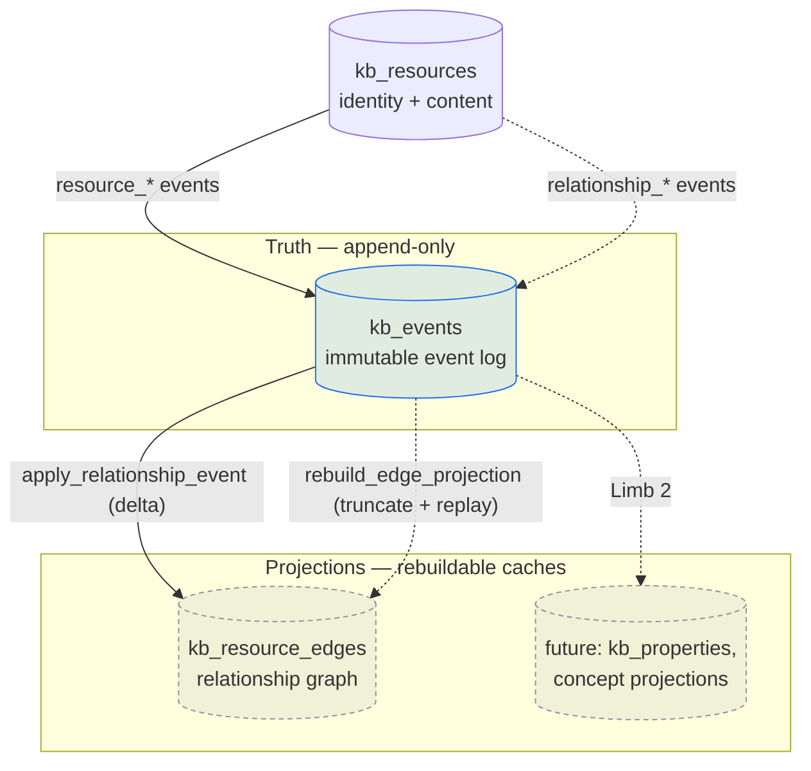

# Event-Sourced Architecture

Temper is migrating its substrate from a **schema-driven** model — where the
shape of `kb_resources` rows *is* the truth — to an **event-driven** model,
where an append-only ledger of events is the truth and everything else is a
**projection** rebuilt from that ledger.

This document is the design narrative for that shift. It explains the
resource ↔ event ↔ projection model, documents how relationship edges work
today (Limb 1, post-PR-93), and summarizes what the upcoming Limb 1c arc
restructures. It is meant to be the referenceable overview that the Limb 1c
implementation builds against.

> **Scope.** Everything in [The model](#the-model), [The event ledger](#the-event-ledger),
> and [Edges as a projection](#edges-as-a-projection-limb-1) describes code that
> exists today. [What Limb 1c restructures](#what-limb-1c-restructures) describes
> *design intent* — none of those tables exist yet (verified against
> `migrations/`).

## The shift: schema-driven → event-driven

In the schema-driven world, a resource's relationships, salience, and access
were columns and join tables you mutated in place. The current state was the
only state; history lived (if anywhere) in an audit log that nothing replayed.

The event-driven world inverts this. State changes are recorded as immutable
**events** in `kb_events`. Derived structures — the edge graph, salience
properties, and eventually concept projections — are **projections**: stored,
queryable tables that can be *truncated and rebuilt* by replaying the event
stream. The projection is a cache of the ledger, never the source of truth.

Two properties fall out of this and motivate the whole arc:

- **Rebuildability.** A projection bug is a replay away from being fixed — drop
  the table, replay the events, get a provably-consistent snapshot. There is a
  test harness that asserts exactly this (drop + rebuild = identical state).
- **Lifecycle as history.** An edge isn't just "present" or "absent"; it has a
  genesis, retypes, reweights, and folds, all recorded. Retraction is
  non-destructive (a fold event), so the graph's evolution is itself queryable.

## The model



Three roles:

- **`kb_resources`** — resource identity and content (title, body, hashes).
- **`kb_events`** — the append-only ledger; the single source of truth for
  changes.
- **Projections** (e.g. `kb_resource_edges`) — derived, rebuildable views over
  the ledger.

## The event ledger

The ledger is a single **unified** table, `kb_events`. There is no separate
`kb_relationship_events` table — relationship events and resource events share
one ledger. Unification landed in migration
`20260522000001_event_ledger_unification.sql`, which also dropped the test-only
`event_substrate` schema and added the registry tables `kb_event_types`,
`kb_topics`, and `kb_scopes`.

### Row shape

The `kb_events` row, after the unification migration
(`migrations/20260522000001_event_ledger_unification.sql`):

| Column | Type | Notes |
| --- | --- | --- |
| `id` | `uuid` PK | UUIDv7 or caller-supplied |
| `profile_id` | `uuid` | Emitter profile |
| `device_id` | `varchar(64)` | `"ledger"` or caller-supplied |
| `kb_context_id` | `uuid?` | FK `kb_contexts` |
| `resource_id` | `uuid?` | FK `kb_resources` |
| `event_type_id` | `uuid` | FK `kb_event_types` (replaced varchar) |
| `payload` | `jsonb` | Event-type-specific structure |
| `metadata` | `jsonb` | Default `{}` |
| `references` | `jsonb` | Array of event cross-references |
| `correlation_id` | `uuid` | Lifecycle root for event chains |
| `occurred_at` | `timestamptz` | Event causality time |
| `created` | `timestamptz` | Ledger record (commit) time |
| `topic_id` | `uuid?` | FK `kb_topics` (framing class) |
| `scope_id` | `uuid?` | FK `kb_scopes` |

### Two write paths

Events reach the ledger by two distinct paths, and the distinction matters:

1. **Legacy Postgres function `insert_event_and_audit`** — the schema-driven
   resource path. Defined in
   `migrations/20260522000001_event_ledger_unification.sql:135`, called from the
   resource mutation paths (`crates/temper-api/src/services/resource_service.rs:933`,
   `:1008`, `:1194`) and ingest
   (`crates/temper-api/src/services/ingest_service.rs:160`). Emits
   `resource_created`, `body_updated`, `managed_meta_updated`,
   `resource_deleted`. It auto-registers unknown event types via
   `resolve_event_type` (insert-or-get) and kept a stable signature across the
   unification so callers never had to change.

2. **Limb-1 `append_event_tx`** — the structured event path in the
   `temper-events` crate (`crates/temper-events/src/ledger.rs:11`). Takes a typed
   `EventToWrite`, enforces strict validation (FK existence for profile /
   topic / scope, reference invariants), and **rejects** unknown event types.
   Used for the `relationship_*` (and future `concept_*`) events. Events
   written this way always carry `device_id = "ledger"`.

The contrast is the migration in miniature: the legacy path is lenient and
schema-shaped; the Limb-1 path is strict, typed, and enum-validated. New work
goes through the strict path.

### Event taxonomy

`EventType` (`crates/temper-events/src/types/event.rs:5`) enumerates the
ledger's vocabulary. The `relationship_*` variants are the live, projected ones
today; `Concept*` are registered placeholders whose projection is Limb 2:

| Variant | Canonical name | Status (apply logic) |
| --- | --- | --- |
| `ConceptCreated` | `ConceptCreated` | Limb 2 — projection pending |
| `ConceptMutated` | `ConceptMutated` | Limb 2 — projection pending |
| `RelationshipAsserted` | `relationship_asserted` | Upsert edge (genesis) |
| `RelationshipRetyped` | `relationship_retyped` | Update kind + polarity |
| `RelationshipReweighted` | `relationship_reweighted` | Update weight |
| `RelationshipFolded` | `relationship_folded` | Set `is_folded = true` |
| `RelationshipDecayed` | `relationship_decayed` | No-op (phase 4) |
| `RelationshipCorrected` | `relationship_corrected` | No-op (phase 4) |

The relationship taxonomy and its `edge_kind` / `edge_polarity` enums were
registered in `migrations/20260522100001_relationship_event_taxonomy.sql`.

## Edges as a projection (Limb 1)

`kb_resource_edges` is a stored, rebuildable projection of the relationship
event stream — **not** a computed-on-read view and **not** a hand-mutated table.
Edges-as-projection landed in
`migrations/20260522100002_edges_as_projection.sql`, which also synthesized
genesis `relationship_asserted` events from any pre-existing edge rows so that
legacy edges became real ledger history (the intent=migration pattern from
PR #93).

### The SST taxonomy

Edges are typed by a small, fixed **Semantic Spacetime** vocabulary rather than
an open-ended relationship-type set
(`crates/temper-core/src/types/graph.rs`):

- **`EdgeKind`** = `Express`, `Contains`, `LeadsTo`, `Near` (`:72`).
- **`Polarity`** = `Forward`, `Inverse` (`:95`).
- **`label`** is free-text — the human-meaningful relationship name layered on
  top of the structural kind/polarity.

The legacy open-ended `EdgeType` (`RelatesTo`, `Extends`, `DependsOn`,
`References`, `ParentOf`, `PrecededBy`, `DerivedFrom`) is preserved only as a
compatibility shim: `EdgeType::legacy_mapping()` (`:105`) collapses each onto an
`(EdgeKind, Polarity, label)` triple — e.g. `ParentOf → (Contains, Forward,
"parent_of")`, `DependsOn → (LeadsTo, Inverse, "depends_on")`, `RelatesTo →
(Near, Forward, "relates_to")`.

### The delta function

`apply_relationship_event`
(`crates/temper-api/src/services/relationship_service.rs:209`) applies one event
to the projection. Each event is keyed to an edge lifecycle by `correlation_id`:

- **`RelationshipAsserted`** (`:215`) — upserts the edge
  (`INSERT … ON CONFLICT (uq_resource_edge) DO UPDATE`). On genesis, both the
  edge's `asserted_by_event_id` and the event's `correlation_id` equal the
  asserting event's id. Re-asserting a folded edge starts a new chain.
- **`RelationshipRetyped`** (`:300`) — updates `edge_kind` / `polarity` on the
  row whose `asserted_by_event_id == event.correlation_id`.
- **`RelationshipReweighted`** (`:330`) — updates `weight`.
- **`RelationshipFolded`** (`:352`) — sets `is_folded = true` (non-destructive
  retraction).
- **`RelationshipDecayed` / `RelationshipCorrected`** (`:373`) — no-ops today;
  decay and scar mechanics are deferred to phase 4.

The edge row carries `asserted_by_event_id` (immutable, the genesis event) and
`last_event_id` (the most recent event in the chain), so the full lifecycle is
reconstructable from any edge.

### Rebuilding

`rebuild_edge_projection` (`relationship_service.rs:504`) is the proof that the
projection is derivative: it `TRUNCATE`s `kb_resource_edges`, then replays every
`relationship_*` event in ledger order (`ORDER BY occurred_at ASC, id ASC`,
`:534`) through `apply_relationship_event`. It is idempotent — running it twice
yields an identical snapshot — and the test harness uses it to assert
drop-then-rebuild consistency.

### Slug-target reprojection

An assertion can target a resource that doesn't exist yet (a `TargetEndpoint::Slug`
that doesn't resolve). Such an event is recorded in the ledger but **skips**
projection until the target appears; when a resource is later created,
`reproject_pending_for_resource` (`relationship_service.rs:411`) replays the
unresolved slug assertions for it. This keeps the ledger authoritative even when
edges are asserted out of creation order.

## Worked example: linking a session to its task

Tier 2.1 made session→task linking the first real consumer of the relationship
API outside tests, which makes it the clearest end-to-end trace of the model.

```mermaid
sequenceDiagram
    participant CLI as temper resource create<br/>--type session --task &lt;slug&gt;
    participant API as POST /api/relationships
    participant SVC as relationship_service
    participant LED as kb_events
    participant PRJ as kb_resource_edges

    CLI->>CLI: create session resource (committed first)
    CLI->>CLI: find_task(slug) → task id
    CLI->>API: AssertRelationshipRequest<br/>{LeadsTo, Forward, "advances", 1.0}
    API->>SVC: AssertRelationship command
    SVC->>LED: append_event_tx → relationship_asserted<br/>(correlation_id = event.id)
    SVC->>PRJ: apply_relationship_event → upsert edge
    Note over CLI,PRJ: link is best-effort — warns, never blocks create
```

The hops, with citations:

1. The session resource is created and committed *first*; linking is a
   best-effort follow-on (`crates/temper-cli/src/commands/resource.rs:240`).
2. The task slug is resolved via `actions::task::find_task` (`:284`).
3. The request is built with a **fixed** shape — `EdgeKind::LeadsTo`,
   `Polarity::Forward`, `label = "advances"`, `weight = 1.0`
   (`crates/temper-cli/src/commands/resource.rs:295`, label at `:300`).
4. `client.relationships().assert` POSTs to `/api/relationships`
   (`crates/temper-client/src/relationships.rs:29`), handled by
   `crates/temper-api/src/handlers/edges.rs:45`, which builds an
   `AssertRelationship` command and dispatches it through the backend.
5. The service appends a `relationship_asserted` event and, in the same
   transaction, applies the projection delta (`relationship_service.rs:167`).
6. The edge is readable via `temper resource show <slug> --edges`. The flow is
   exercised end-to-end in
   `tests/e2e/tests/cloud_session_link_e2e_test.rs`.

`AssertRelationshipRequest` itself
(`crates/temper-core/src/types/relationship_requests.rs:16`) carries `source`,
`target_slug`, `edge_kind`, `polarity`, `label`, and `weight`. The on-the-wire
target uses `TargetEndpoint` (`relationship_events.rs:16`), a tagged enum of
`Resource(Uuid)` or `Slug(String)`.

## What Limb 1c restructures

Limb 1c is the next arc. It is **design intent, not yet implemented** — none of
the tables below exist in `migrations/` today. The authoritative source is the
decision doc `2026-05-27-access-wrapper-extraction-and-polymorphic-projection-substrate`
(temper context, doctype `decision`); this is a summary, not a substitute.

### Motivation: the C-suite-leak layer-conflict

The triggering problem is a layer-conflict between team-RBAC and scope-RBAC.
Because `kb_resources` rows carry `kb_context_id` (which carries owner-team via
`kb_contexts.kb_owner_*`), making concepts a resource doctype with a `scope_id`
would make them inherit *both* context-team access and scope access. The
concrete hazard: a C-suite profile with broad access joining a cross-functional
scope would leak their individual access set into the scope's working set via
agent graph-traversal — pulling private documents into shared cognitive-map
artifacts.

### The restructure

The fix is to pull access and navigation concerns **off** `kb_resources` rows
and into polymorphic wrapper tables, using the `(anchor_table, anchor_id)`
discriminator pattern already proven on `kb_contexts.kb_owner_*`:

- **`kb_resources` slims to identity + content.** `kb_context_id`,
  `owner_profile_id`, `originator_profile_id`, and `slug` move out.
- **`kb_resource_homes`** — the navigational projection: one home per resource,
  carrying slug + anchor (`kb_contexts` or `kb_scopes`) + authorship. The
  URI/folder model becomes a navigation affordance, structurally separate from
  access truth.
- **`kb_resource_access`** — explicit access grants beyond what the home anchor
  implies; subsumes `kb_team_resources`.
- **`kb_resource_edges` → `kb_edges`** — the edge projection is renamed and made
  polymorphic on *both* endpoints (`source_table` / `target_table` over
  `kb_resources` or `kb_scopes`), with a nullable `scope_id` for
  cognitive-map-layer edges. The SST taxonomy and the event-sourcing pattern
  (`asserted_by_event_id`, `last_event_id`, `is_folded`) carry over unchanged.
- **`kb_salience_properties` → `kb_properties`** — renamed and made polymorphic
  on owner, with values in JSONB. Entity-references stop being properties and
  become edges in `kb_edges`.
- **Teams become a DAG** — `kb_teams` stays, but a `kb_teams_parents` junction
  table (the tasker-core `workflow_step_edges` pattern) supports multi-parent
  hierarchies. `kb_team_scopes` associates scopes with teams.

The access functions (`resources_visible_to`, `can_modify_resource`, and the new
producer-side `resources_accessible_to_scope`) are rewritten against these
tables. The C-suite-leak fix becomes structural: producer-access for a scope is
bounded by the teams explicitly associated via `kb_team_scopes` and is **not**
expanded to individual members' access — so an agent emitting in a scope can
reference only what the scope can see, regardless of who is at the keyboard.

`kb_events` itself carries over unchanged; Limb 1c only registers new event-type
names (`concept_*`, `property_*`, `scope_*`, `team_parent_*`, plus a widened
`relationship_asserted` payload) and ships as a phased migration with green
intermediate states throughout. Concept-convergence proper is the renumbered
Limb 2, built on the cleaned substrate.

## Related documents

- [`vault-projection-cache-design.md`](./vault-projection-cache-design.md) — the
  client-side counterpart: how the read-only vault projection is materialized
  from this cloud state.
- The decision doc
  `2026-05-27-access-wrapper-extraction-and-polymorphic-projection-substrate`
  (temper context) — the authoritative Limb 1c design record.
- The research doc `2026-05-19-event-sourced-knowledge-graph-relationships`
  (temper context) — the original edges-as-projections research.
- [`CLAUDE.md`](../CLAUDE.md) — "Service layer owns SQL; surfaces dispatch
  through `DbBackend`" and the write-path conventions referenced above.
