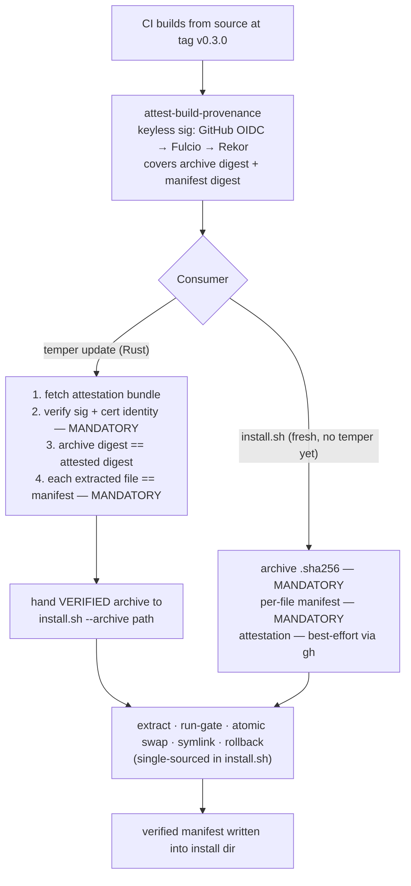

# Binary attestation and per-file manifest verification

**Date:** 2026-07-29
**Status:** Design approved, pending implementation plan
**Scope:** `build-cli-binaries.yml`, `release.yml`, `create-github-release.sh`, `scripts/install/install.sh`, `crates/temper-cli/src/commands/{version,update}.rs`

## The question this exists to answer

> *Is the `temper` on my machine byte-identical to what you published for this version — and can I
> prove that without taking your word for it?*

Today that question is **unanswerable**, by construction. This design makes it answerable, and makes
`temper update` refuse to complete an install that cannot answer it affirmatively.

## Current state (grounded)

| Fact | Location |
|---|---|
| A `.sha256` sidecar is computed **over the archive**, not over any file inside it | `build-cli-binaries.yml:177,189` |
| Archive + sidecar are uploaded to the same GitHub Release by the same token | `create-github-release.sh:30-35` |
| `install.sh` verifies the archive against that sidecar, then gates on "the new binary runs" | `install.sh:126-134`, `install.sh:171` |
| `temper update` pipes the embedded `install.sh` to `sh` — it inherits exactly that verification and nothing more | `update.rs:180` |
| `temper version --checksum` hashes the running binary and explicitly notes it **will not match** the published sidecar | `version.rs:32-35` |

Two gaps follow:

1. **The sidecar is self-asserted.** It sits beside the artifact it describes, uploaded by the same
   credential. Anyone who can replace the archive can replace its checksum. It establishes transport
   integrity (corrupt download, CDN tampering), never provenance.
2. **No published hash exists for the binary itself.** The archive-level sidecar measures a different
   object than the installed binary, which is why `CHECKSUM_NOTE` has to disclaim the comparison
   rather than perform it.

## The incumbent this design extends

The codebase already has an answer to *"is this shipped file the one we built against?"*, and this
design must extend its shape rather than invent a parallel scheme:

- `crates/temper-ingest/build.rs` derives the model's sha256 **from the artifact as committed**
  (smudged file, or the LFS pointer whose `oid` *is* the sha256), so the constant cannot drift, and
  emits it as `TEMPER_EXPECTED_MODEL_SHA256`.
- `embed.rs:313` compiles it in: `pub const EXPECTED_MODEL_SHA256: &str = env!("TEMPER_EXPECTED_MODEL_SHA256")`.
- `embed.rs:341,382` — `verify_model_file` **refuses to load** on mismatch.

**The doctrine: derive the expected hash at build time from the real artifact, compile it in, verify
at use, refuse on mismatch.** Every decision below is that doctrine applied one level up — to the
binary itself, and to the trust root used to verify it.

It also exposes the one thing a binary fundamentally cannot do: **a binary cannot contain its own
hash** (adding the hash changes the hash). Verifying the *binary* therefore always requires an
external reference. That reference is what the release must publish, and how strong it is, is the
whole design.

## Threat model

All four are in scope:

1. **Tampered or corrupt install** — a definitive verdict on whether the installed files match what
   was published. Catches corrupt downloads, partial swaps, local modification, a hand-placed binary.
2. **Compromised release artifact** — an actor with release-write access swaps the archive *and* its
   sidecar together. A checksum beside the file it describes cannot catch this; only provenance
   signed by something other than the release itself can.
3. **Compliance / enterprise audit** — a third party independently verifies the chain with their own
   tooling, without trusting our word or our release page.
4. **Model + ORT lib integrity** — the archive also ships `lib/libonnxruntime.*` and
   `models/model_quantized.onnx`. A swapped model silently corrupts the semantic index. Verification
   covers every shipped file, not just the binary.

## Architecture

### 1. What the release publishes

Per target triple, added to the existing archive and `.sha256`:

- **`temper-v{ver}-{triple}.manifest.json`** — sha256 and size for **every** file in the archive:
  `temper`, `lib/libonnxruntime.*`, `models/model_quantized.onnx`, `LICENSE`.
- **A GitHub build-provenance attestation** (`actions/attest-build-provenance`), covering **both**
  the archive and the manifest — so the manifest cannot be swapped independently of the artifact it
  describes. Requires `attestations: write` and `id-token: write` on the job.

**The manifest is generated in the workflow** with `shasum`/`sha256sum` (the dual-tool pattern
already at `build-cli-binaries.yml:177,189`) — **not** by running the freshly-built binary.

> **Rejected: self-description.** Having the built binary emit its own manifest is tempting (all
> three runners are native, so the artifact *can* run) and would give one Rust code path for
> producing and consuming the manifest. It is rejected because it is circular under threat model #2:
> a compromised artifact would describe itself, and the manifest would faithfully attest to the
> compromise.

Consumed in Rust via a typed `ReleaseManifest` struct with a golden-fixture round-trip test, per the
repo's typed-structs-at-boundaries rule. The bash producer and the Rust consumer are two ends of one
wire format; the fixture is what keeps them from drifting.

### 2. Trust chain

Cert identity verified on the Rust path: issuer = GitHub Actions OIDC, SAN =
`https://github.com/tasker-systems/temper/.github/workflows/build-cli-binaries.yml@refs/heads/main`.
The SLSA predicate's `buildDefinition.externalParameters.workflow.path` is also
pinned to `.github/workflows/release-tag.yml` (the chain's entry workflow),
which closes the direct-`workflow_dispatch` door on `build-cli-binaries.yml`.

> **Why `refs/heads/main`, not `refs/tags/{tag}`:** the release chain is
> branch-triggered by construction — `release-tag.yml` fires on a `VERSION`-file
> push to `main`, creates and pushes the tag with `GITHUB_TOKEN`, then calls
> `release.yml` → `build-cli-binaries.yml` via `workflow_call`. A tag pushed with
> `GITHUB_TOKEN` does not trigger workflows (`release-tag.yml:53-56` documents
> this), so `release.yml`'s own `on: push: tags: v*` never fires. A reusable
> workflow called via `workflow_call` inherits the caller's `github.ref`, which
> is `refs/heads/main` throughout the chain — so the OIDC token's `ref` claim,
> and therefore the Fulcio cert SAN, carries `@refs/heads/main` for every
> release. The tag is carried by the archive filename
> (`temper-v{version}-{target}.tar.gz`) and the manifest's `version` field, not
> by the cert SAN. The digest match (enforced in `verify_release_attestation`)
> is what binds to a specific release artifact.

### 3. The pinned trust root

**Decision: compile the sigstore trust root in as a build-time constant. Do not run a TUF client.**

`sigstore-rs`'s default `SigstoreTrustRoot` fetches TUF metadata from the network at verification
time. Depending on it would inherit a slice of an ecosystem problem that is demonstrably unsettled —
[rust-lang/rfcs#3724](https://github.com/rust-lang/rfcs/pull/3724) (TUF for Rust Project releases and
crates.io) is **open**, with unresolved blockers around TAP-16 snapshot scalability at crates.io's
publish rate, repository architecture, governance quorums, and HSM key-lifetime operations drawn from
PyPI's experience.

Those blockers are **operational**, not cryptographic. Pinning the trust root avoids them entirely:
it reduces the requirement from *"implement TUF"* to *"verify a signature bundle against a known
key"* — a small, auditable surface. It converts an open ecosystem problem into a closed
release-engineering one, and it is the `EXPECTED_MODEL_SHA256` doctrine applied to the trust root.

**The cost, stated plainly: root rotation.** A pinned old root cannot verify an attestation signed
under a new one. Three things bound it:

- **Updates chain.** v0.3's pinned root verifies v0.4's attestation; v0.4 ships the newer root. Only
  a rotation landing *between* the installed version and the target bites.
- **Fulcio's public-good root is long-lived**, so rotation is rare and pre-announced.
- **The failure is distinguishable** — unknown/expired root is not the same condition as a bad
  signature.

**It must fail loudly with the recovery command, and must never degrade to a warning.** A silent
downgrade to unverified is precisely the hole this design closes. The escape hatch is re-running
`install.sh`, which is hash-verified.

> **Standing release obligation:** when sigstore rotates its root, we cut a release promptly. This is
> a known, bounded operational cost accepted in exchange for not depending on an immature TUF client.

The spike must also establish **what** to pin — root cert, intermediate, or Rekor key — rather than
assuming.

### 4. `temper update` and the "one installer, one truth" tension

`update.rs:47-50` embeds `install.sh` on an explicit principle: the binary owns *policy*, the script
owns *mechanism*, so download/verify/swap can never fork between a fresh install and an update.

Mandatory native attestation verification creates a TOCTOU hole against that principle: Rust would
verify an attestation over archive X, then the script would download archive X *again* and swap in
whatever arrived the second time. The verification would decorate a different object than the one
installed.

**Resolution — which honors the stated division of labor rather than breaking it:** Rust downloads
and verifies, then hands the verified local archive to the script via a new **`--archive <path>`**
flag that skips **only** the download step. Extract, hash-check, run-gate, atomic swap, symlink, and
rollback all remain single-sourced in `install.sh`. Verification is *policy*; it belongs on the Rust
side by the module's own doctrine.

### 5. CLI surfaces

Extending `version.rs` — no new top-level command.

| Surface | Behavior |
|---|---|
| `temper version --checksum` | Keeps today's self-attestation, and gains a **verdict** when a local manifest exists: `verified` / `mismatch` / `unverifiable` |
| `temper version --verify` | Offline: running binary + ORT lib + model vs the install-dir manifest |
| `temper version --verify --online` | Re-fetches the published manifest *and* attestation for this exact version. This is the audit that answers the opening question |

A `cargo install` build has no manifest and no archive: it reports **`unverifiable`**, never
`mismatch` — mirroring the honesty of the existing `CARGO_REFUSAL` (`update.rs:58`). "We cannot tell"
and "it is wrong" are different claims and must render differently.

### 6. Failure posture — reuse the rollback that already exists

`install.sh:209-220` already drops the `OLD` backup only after the live binary passes `--version`.
That gate **widens from "it runs" to "it runs *and* every file matches the manifest."** A tampered or
corrupt install therefore rolls back through machinery that is already written, already atomic, and
already handles the cannot-restore case by reporting where the backup survives.

No new rollback path is introduced. This is the single most important reason to place verification at
this point in the sequence rather than earlier.

## Honesty constraints

These follow the pattern this codebase already set with `CHECKSUM_NOTE`, and are load-bearing:

1. **Offline `--verify` is not adversarially meaningful, and must say so.** It compares a binary
   against a manifest **in the same directory** — an actor who replaced one can replace the other. It
   detects corruption and drift, not an active attacker. Only `--online` (attestation-backed) carries
   provenance weight. The output must state this distinction rather than let a `verified` verdict
   imply more than it earned.

2. **The manifest is not the model's primary guard.** `EXPECTED_MODEL_SHA256` is compiled in and
   `verify_model_file` refuses to load on mismatch (`embed.rs:341,382`) — a strictly stronger
   guarantee than a manifest entry. Manifest coverage of the model is corroborating defense-in-depth
   that moves *detection earlier* (install time rather than first-embed time). The spec, the code
   comments, and the docs must not imply the manifest supersedes the compiled-in pin.

## The spike, and its BLOCKED arm

`sigstore-verification` (0.2.8) leads: it exposes `verify_github_attestation()` and
`verify_slsa_provenance()` — purpose-built entry points for this exact case — alongside
`AttestationClient`/`AttestationClientBuilder` and `Policy`. `sigstore-verify` (0.11.0) is the
alternative. Both repos are active. The flagship `sigstore` crate (0.14.0) self-describes as
*"An experimental crate"*, which is the maturity caveat this spike exists to discharge.

**The decision rule:**

> Can `sigstore-verification` or `sigstore-verify` verify a real GitHub attestation bundle against a
> **caller-supplied, pinned** trust root, with no network TUF fetch?
>
> - **Yes** → native verification as designed above.
> - **No** → report **BLOCKED**. Fall back to hashes-mandatory / attestation-audit-only: the
>   attestation is still published and documented for out-of-band `gh attestation verify`, and the
>   design keeps the per-file manifest, the verdicts, and rollback-on-mismatch. It loses only in-band
>   provenance on update.
> - **Never** hand-roll certificate-chain verification with `x509-parser`/`p256` to rescue the "yes"
>   arm. Hand-rolled crypto is a worse outcome than the fallback.

The docs excerpt for `sigstore-verification` does **not** settle the pinned-root question. That is a
genuine open question, not a formality — the spike is the first task in the plan and its outcome
selects the architecture.

## Out of scope

### Deferred

- **Windows.** `install.ps1` gets no manifest verification and no attestation-verified update path in
  this work. Deferred because there is effectively no Windows install base today and no way to test
  it for real; revisit when a community tester opts in. `temper update` already refuses on Windows
  (`update.rs:71`).

  **This deferral is a declared hole, not a gap.** Per the active goal *"Surface parity — no door
  offers less than another without saying so"* (`019fa618-ce41-7762-97dd-179132503ea2`), the
  asymmetry must be stated everywhere it is observable:
  - `temper version --verify` on Windows reports **`unverifiable`** — never `verified`.
  - `WINDOWS_REFUSAL` (`update.rs:71`) and the install docs state that Windows installs are
    hash-verified only, with no attestation-verified update path.

### Rejected

- **Mandatory attestation verification at fresh install.** Would make `curl … | sh` hard-depend on
  `gh` or `cosign`, failing on machines without the tool — or bootstrap-downloading a second binary
  to verify the first, which has its own unsolved trust problem. Fresh installs get mandatory hash
  verification and best-effort attestation; every *update* gets full provenance.
- **A self-describing manifest** emitted by the built binary. Circular under threat model #2 (see
  §1).
- **Hand-rolled certificate-chain verification.** See the spike's BLOCKED arm.

## Testing

| Layer | Coverage |
|---|---|
| Unit (`version.rs`) | Verdict rendering: `verified` / `mismatch` / `unverifiable`; the cargo-install path yields `unverifiable`, never `mismatch`; the offline-limitation disclaimer is present in output |
| Unit (`ReleaseManifest`) | Golden-fixture round-trip against a manifest produced by the *actual* workflow bash, so producer and consumer cannot drift |
| Unit (trust root) | A bundle signed under an unpinned root fails as **unknown-root**, distinguishably from **bad-signature** |
| Integration (`install.sh`) | A manifest mismatch on an extracted file triggers **rollback**, and the prior install survives; `--archive <path>` skips download and uses exactly the supplied file |
| Spike (task 1) | A real GitHub attestation bundle verifies against a pinned root, or the BLOCKED arm fires |

Per repo convention, a test that must *bite* has to fail against the state it claims to change: the
rollback test must demonstrably leave the old install in place when a single file's hash is altered.

## Sequencing

1. **Spike** the two sigstore crates against a real attestation bundle with a pinned root. Outcome
   selects the architecture. BLOCKED arm is a legitimate result.
2. **Publish side** — manifest generation + `attest-build-provenance` in `build-cli-binaries.yml`;
   upload manifest in `create-github-release.sh`.
3. **`install.sh`** — mandatory per-file manifest verification; `--archive <path>`; widen the
   post-swap gate to include manifest match; write the verified manifest into the install dir.
4. **`version.rs`** — verdicts, `--verify`, `--verify --online`.
5. **`update.rs`** — native attestation verification, then hand the verified archive to the script.
6. **Docs** — install/releasing guides, the Windows declared hole, the root-rotation release
   obligation.

Steps 2–4 are independently useful and ship value even if step 1 returns BLOCKED.
