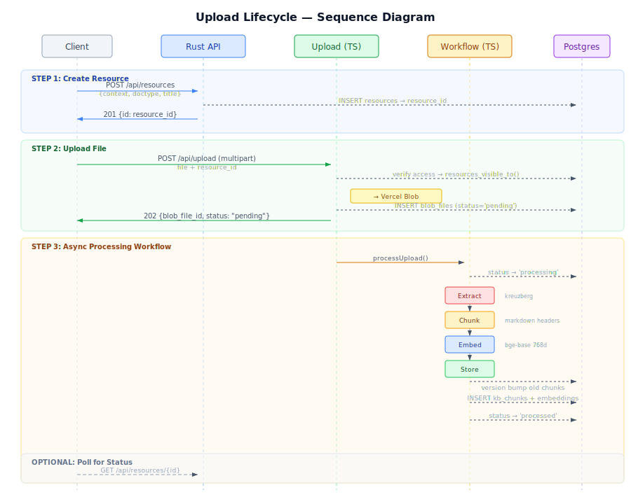
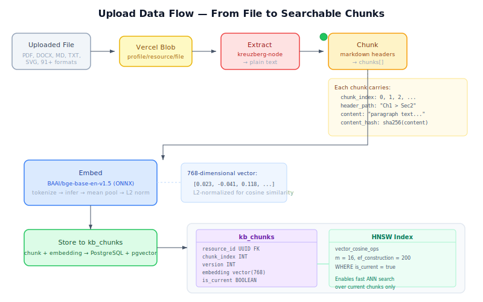

# Upload Lifecycle

The upload lifecycle describes how files flow from an authenticated client through the temper-cloud API into searchable, version-tracked knowledge base chunks with vector embeddings.

## Architecture Overview

temper-cloud runs two runtimes in a single Vercel project at **temperkb.io**:

- **Rust (axum)** handles the core API: resource CRUD, search, profiles, teams, events
- **TypeScript (Node.js)** handles file upload and the async processing workflow

Both runtimes share the same JWT authentication (EdDSA via Neon Auth JWKS). Vercel's file-based routing auto-detects the runtime from `api/axum.rs` (Rust) and `api/upload.ts` (TypeScript).

```
                          temperkb.io
                    ┌─────────────────────┐
                    │    Vercel Router     │
                    │  (file-based detect) │
                    └────┬───────────┬─────┘
                         │           │
              ┌──────────▼──┐   ┌────▼──────────┐
              │  Rust/axum  │   │  TypeScript    │
              │             │   │  (Node.js)     │
              │ /api/health │   │ /api/upload    │
              │ /api/resources│ │                │
              │ /api/search │   │ /api/workflows/│
              │ /api/profile│   │  process-upload│
              │ /api/events │   │                │
              └──────┬──────┘   └───────┬────────┘
                     │                  │
                     └──────┬───────────┘
                            │
                     ┌──────▼──────┐
                     │  Neon       │
                     │  PostgreSQL │
                     │  + pgvector │
                     └─────────────┘
```



## The Resource-First Upload Flow

Uploading a file is a two-step process. The resource record is created first (establishing context, document type, and ownership), then the file is uploaded referencing that resource.

This separation means the resource exists as a first-class entity in the knowledge base before any file processing occurs. The client abstracts this into a single operation.

### Step 1: Create Resource (Rust)

```
POST /api/resources
Authorization: Bearer <jwt>
Content-Type: application/json

{
  "kb_context_id": "...",
  "kb_doc_type_id": "...",
  "uri": "vault://notes/architecture.md",
  "title": "Architecture Notes",
  "mimetype": "text/markdown"
}

→ 201 { "id": "<resource_id>", ... }
```

The Rust handler:
1. Verifies the JWT (EdDSA, Neon Auth JWKS)
2. Resolves the authenticated profile from `kb_profiles`
3. Generates a UUIDv7 resource ID
4. Inserts into `resources` with the profile as originator and owner
5. Returns the full resource record

### Step 2: Upload File (TypeScript)

```
POST /api/upload
Authorization: Bearer <jwt>
Content-Type: multipart/form-data

file: <binary>
resource_id: <uuid from step 1>

→ 202 { "blob_file_id": "...", "status": "pending" }
```

The TypeScript handler:
1. Verifies the same JWT (jose library, same JWKS endpoint)
2. Resolves the profile via `auth_provider_sub`
3. Checks resource visibility via `resources_visible_to()` SQL function
4. Uploads the file to **Vercel Blob** at path `{profileId}/{resourceId}/{filename}`
5. Inserts a `blob_files` record with status `pending`
6. Triggers the processing workflow (durable, async)
7. Returns 202 immediately — processing continues in the background

### Step 3: Async Processing Workflow

The workflow runs as a Vercel durable function with four steps. Each step is independently retriable via the `"use step"` directive.

```
┌─────────────────────────────────────────────────────────┐
│                   processUpload()                       │
│                  "use workflow"                          │
│                                                         │
│  ┌──────────┐   ┌──────────┐   ┌─────────┐   ┌──────┐ │
│  │ Extract  │──▶│  Chunk   │──▶│  Embed  │──▶│ Store│ │
│  │          │   │          │   │         │   │      │ │
│  │kreuzberg │   │ markdown │   │bge-base │   │  pg  │ │
│  │ 91+ fmt  │   │  headers │   │ en v1.5 │   │vector│ │
│  └──────────┘   └──────────┘   └─────────┘   └──────┘ │
│                                                         │
│  blob_files.status:                                     │
│  pending → processing ─────────────────────→ processed  │
│                    └─── on error ──────────→ failed     │
└─────────────────────────────────────────────────────────┘
```



## Processing Pipeline Detail

### Extract

**Source:** `packages/temper-cloud/src/workflow/extract.ts`

The extract step downloads the file from Vercel Blob and converts it to plain text using [kreuzberg-node](https://www.npmjs.com/package/@kreuzberg/node), a Rust-native document extraction library with Node.js bindings via napi-rs.

Verified formats (via integration tests):

| Format | Extension | Notes |
|--------|-----------|-------|
| Markdown | `.md` | Full text preserved |
| Plain text | `.txt` | Passthrough |
| PDF | `.pdf` | Text layer extraction |
| Word | `.docx` | Headers and body text |
| SVG | `.svg` | Embedded text elements |
| Images | `.png`, `.jpg` | Requires Tesseract (optional) |

kreuzberg claims 91+ format support. Images with text require Tesseract OCR as an optional system dependency — not available on Vercel serverless. Without Tesseract, image uploads receive `status: "failed"`.

**Status transition:** `pending` → `processing`

### Chunk

**Source:** `packages/temper-cloud/src/workflow/chunk.ts`

Text is split into chunks along Markdown header boundaries. The chunking algorithm:

1. Scans line-by-line for Markdown headers (`# ` through `###### `)
2. Maintains a header stack tracking nesting depth
3. Flushes accumulated content when a new header is encountered
4. Builds a `header_path` breadcrumb from the header stack (e.g., `"Getting Started > Installation"`)
5. Computes a SHA-256 `content_hash` for each chunk (used for deduplication and change detection)

Plain text without headers produces a single chunk with an empty `header_path`.

Each chunk carries:
```typescript
{
  chunk_index: number,     // sequential, 0-based
  header_path: string,     // "Parent > Child > Grandchild"
  content: string,         // text between headers
  content_hash: string     // SHA-256 hex digest
}
```

### Embed

**Source:** `packages/temper-cloud/src/workflow/embed.ts`

Chunks are embedded into 768-dimensional vectors using [BAAI/bge-base-en-v1.5](https://huggingface.co/BAAI/bge-base-en-v1.5), a sentence embedding model optimized for retrieval.

| Property | Value |
|----------|-------|
| Model | BAAI/bge-base-en-v1.5 |
| Dimensions | 768 |
| Runtime | ONNX (onnxruntime-node, CPU) |
| Tokenizer | HuggingFace AutoTokenizer |
| Max tokens | 512 |
| Normalization | L2 (unit vectors, cosine-ready) |
| Cache | `/tmp/temper-models/bge-base-en-v1.5/` |

The embedding pipeline:
1. **Tokenize** all chunk texts as a batch (padding + truncation to 512 tokens)
2. **Infer** via ONNX session → `last_hidden_state` tensor (batch x seq_len x 768)
3. **Mean pool** across tokens, respecting the attention mask (real tokens only)
4. **L2 normalize** each vector to unit length

The model is downloaded from HuggingFace on first use and cached locally.

### Store

**Source:** `packages/temper-cloud/src/workflow/store.ts`

The store step writes chunks and their embeddings to `kb_chunks` in PostgreSQL with version management.

**Version lifecycle:**
1. Query the current max version for this resource
2. Compute `next_version = max(version) + 1`
3. Mark all existing chunks as `is_current = false` where `version < next_version`
4. Insert new chunks with `version = next_version` and `is_current = true`
5. Upsert on `(resource_id, chunk_index, version)` composite unique constraint

This means re-uploading the same resource creates a new version. Old chunks remain in the database (for history) but are excluded from search via the `is_current` flag.

**Status transition:** → `processed`

## Database Schema

### blob_files

Tracks uploaded files and their processing status.

```sql
CREATE TABLE blob_files (
    id              UUID PRIMARY KEY DEFAULT gen_random_uuid(),
    profile_id      UUID NOT NULL REFERENCES kb_profiles(id),
    resource_id     UUID REFERENCES resources(id),
    blob_url        TEXT NOT NULL,
    pathname        TEXT NOT NULL,
    content_type    TEXT,
    file_size_bytes BIGINT,
    status          TEXT NOT NULL DEFAULT 'pending'
                    CHECK (status IN ('pending', 'processing', 'processed', 'failed')),
    error_message   TEXT,
    created_at      TIMESTAMPTZ NOT NULL DEFAULT now(),
    updated_at      TIMESTAMPTZ NOT NULL DEFAULT now()
);
```

### kb_chunks

Stores chunked content with vector embeddings, versioned per resource.

```sql
CREATE TABLE kb_chunks (
    id              UUID PRIMARY KEY,
    resource_id     UUID NOT NULL REFERENCES resources(id) ON DELETE CASCADE,
    chunk_index     INT NOT NULL,
    version         INT NOT NULL DEFAULT 1,
    header_path     TEXT NOT NULL DEFAULT '',
    content         TEXT NOT NULL,
    content_hash    VARCHAR(64) NOT NULL,
    embedding       vector(768) NOT NULL,
    is_current      BOOLEAN NOT NULL DEFAULT true,
    created         TIMESTAMPTZ NOT NULL DEFAULT now(),
    UNIQUE(resource_id, chunk_index, version)
);
```

The HNSW index enables fast approximate nearest neighbor search over current chunks:

```sql
CREATE INDEX idx_chunks_current_embedding ON kb_chunks
    USING hnsw(embedding vector_cosine_ops)
    WITH (m = 16, ef_construction = 200)
    WHERE is_current = true;
```

A convenience view filters to current chunks:

```sql
CREATE VIEW kb_current_chunks AS
SELECT id, resource_id, chunk_index, version, header_path,
       content, content_hash, embedding, created
FROM kb_chunks
WHERE is_current = true
ORDER BY resource_id, chunk_index;
```

## Authentication

Both endpoints verify the same JWT:

| Property | Value |
|----------|-------|
| Algorithm | EdDSA (Ed25519) |
| Key source | JWKS endpoint (Neon Auth) |
| Required claims | `sub`, `email` |
| Profile resolution | `kb_profiles.auth_provider_sub = claims.sub` |
| Resource authorization | `resources_visible_to(profile_id)` SQL function |

The `resources_visible_to()` function returns resources the profile owns directly or has access to via team membership, along with the access level (`owner`, `vault`, `mutable`, `immutable`).

## Environment Variables

| Variable | Used by | Purpose |
|----------|---------|---------|
| `DATABASE_URL` | TypeScript | Neon PostgreSQL connection (HTTP driver) |
| `BLOB_READ_WRITE_TOKEN` | TypeScript | Vercel Blob read/write access |
| `JWKS_URL` | TypeScript | Remote JWKS endpoint for token verification |
| `AUTH_ISSUER` | TypeScript | Expected JWT issuer claim |

The Rust runtime reads equivalent configuration from its own environment (see `crates/temper-api`).

## Client Integration (I5)

The temper-client crate will abstract the two-step flow into a single operation:

```
client.add_resource(context, doctype, metadata, file)
  → POST /api/resources      (Rust, create resource)
  → POST /api/upload          (TypeScript, upload file)
  → optionally poll for status
```

The client needs:
- Typed Rust API client (using temper-core types) for the Rust endpoints
- Multipart upload client with its own response type (`{ blob_file_id, status }`) for the TypeScript endpoint
- Shared JWT token for both endpoints
- Error handling for processing failures (`blob_files.status = "failed"`)
