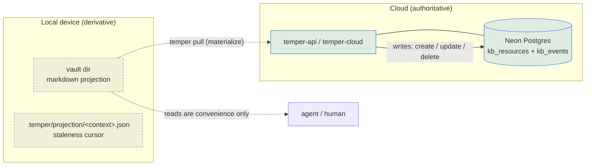

# Vault Projection Cache

Temper is **cloud-only**. The authoritative copy of every resource — its body, its
frontmatter, its relationships — lives in the cloud (Neon Postgres behind the
temper-api / temper-cloud surfaces). The local vault directory on disk is a
**read-only projection cache**: a materialized view of cloud state that exists so
that agents and humans can read resources as plain markdown files without a round
trip per glance.

This document explains how that cache is built (`temper pull`), how reads stay
correct without trusting it (`temper resource show`), why deleting a file does
*not* delete a resource (`rm` vs. `temper resource delete`), and how to
recover a missing or stale projection on a fresh device.

> **Why a projection cache at all?** Markdown-on-disk is the ergonomic surface
> agents already know how to read, grep, and diff. But making disk *authoritative*
> is what the cloud-only migration moved away from — disk drifts, conflicts across
> devices, and can't enforce authorization. So disk is kept as a derivative
> artifact: convenient to read, never trusted for writes. All writes route through
> `temper-client` → `temper-api`. See [`CLAUDE.md`](../CLAUDE.md) ("Cloud
> operations") and the cloud-only deprecation spec for the decision record.

## Mental model



Two invariants follow from this model, and the rest of the document is just their
consequences:

1. **The cloud is the source of truth.** Every write — create, update, delete —
   goes to the API. The projection is updated *after* the server confirms.
2. **The disk is never read back as truth.** No command reads a local file to
   answer a query. `temper resource show` always fetches from the API and treats
   any local copy as disposable.

## On-disk layout

Projected files live under the vault root in an owner-scoped, context-scoped,
doc-type-scoped tree:

```text
<vault_root>/<owner>/<context>/<doc_type>/<slug>.md
```

For example:

```text
<vault_root>/@me/temper/task/2026-05-28-pre-limb-1c-cleanup-sweep.md
<vault_root>/+platform-eng/temper/research/some-shared-spec.md
```

The `<owner>` segment distinguishes personal resources (`@me`) from team-owned
resources (`+<team-slug>`). The path is computed by
`Vault::doc_file(owner, context, doc_type, slug)`
(`crates/temper-core/src/vault.rs:52`), which the projection writer calls for
every materialized file (`crates/temper-cli/src/projection.rs:251`).

Alongside the vault tree, a small staleness cursor is kept per context at
`.temper/projection/<context>.json`. It is **advisory only** — see
[Staleness](#staleness-advisory-only) below.

## `temper pull <context>` — materializing the cache

`temper pull <context>` rebuilds the projection for one context from current
server state. The command takes a single positional `context` argument
(`crates/temper-cli/src/cli.rs:122`) and dispatches to `commands::pull::run`
(`crates/temper-cli/src/commands/pull.rs`), which calls
`projection::pull_context` (`crates/temper-cli/src/projection.rs:321`).

```mermaid
sequenceDiagram
    participant U as temper pull &lt;ctx&gt;
    participant API as temper-api
    participant FS as vault dir
    participant C as cursor file

    U->>API: resources().list(context, limit=200, offset…)
    API-->>U: all resource rows (paginated, 200/page)
    loop for each row
        U->>API: resources().content(resource_id)
        API-->>U: ContentResponse (markdown + managed_meta + open_meta)
        U->>FS: write_resource_file_from_parts → <owner>/<ctx>/<type>/<slug>.md
    end
    U->>FS: prune_context(keep set) — remove .md files not in this pull
    U->>API: events().latest_for_context(context_id)
    API-->>U: latest event id
    U->>C: write ProjectionCursor { last_event_id, pulled_at }
    U-->>U: PullSummary { context, written, pruned }
```

Step by step (`pull_context`, `crates/temper-cli/src/projection.rs:321`):

1. **List** every resource in the context via `client.resources().list(&params)`,
   paginating at `PULL_PAGE_SIZE = 200`
   (`crates/temper-cli/src/projection.rs:314`).
2. **Materialize** each row: `write_resource_file` fetches the body with
   `client.resources().content(resource_id)` and writes the file via
   `write_resource_file_from_parts` (`crates/temper-cli/src/projection.rs:266`,
   `:209`). The absolute path of every written file is collected into a `keep`
   set.
3. **Prune** the context: `prune_context` walks
   `<vault_root>/*/<context>/*/*.md` across all owner directories and removes any
   `.md` file **not** in the `keep` set
   (`crates/temper-cli/src/projection.rs:156`). This is how server-side deletes
   eventually disappear from disk: a resource that no longer lists is no longer
   kept, so its stale projected file is pruned. Pruning is scoped to this
   context's directories and only touches `.md` files; other contexts and
   non-markdown files are untouched.
4. **Record the cursor**: fetch the latest event id for the context
   (`client.events().latest_for_context`) and write
   `ProjectionCursor { last_event_id, pulled_at: now }` to
   `.temper/projection/<context>.json`
   (`crates/temper-cli/src/projection.rs:359`).

### What gets written into each file

`write_resource_file_from_parts` (`crates/temper-cli/src/projection.rs:209`)
assembles a standard frontmatter-plus-body markdown document:

- **Frontmatter** is built from the `ResourceRow` (title, slug, context, doc_type,
  owner) and the `ContentResponse` (managed_meta + open_meta) via
  `ingest::build_frontmatter_from_resource`, then serialized as
  `---\n<yaml>\n---\n<body>` by `Frontmatter::write_to`
  (`crates/temper-core/src/frontmatter/document.rs:141`).
- **Body** is the `markdown` field of the `ContentResponse`.
- **Hashes are not written into the file.** Content hashes / manifests are
  server-side concerns (the `kb_resource_manifests` table); the projected file
  carries no hash of its own.

## `temper resource show` — reads are API-direct

`temper resource show` does **not** read the local projection. It is
API-direct: it resolves the resource and fetches its content from the server every
time, then refreshes the local file as a side effect.

```mermaid
sequenceDiagram
    participant U as temper resource show &lt;slug&gt;
    participant API as temper-api
    participant FS as vault dir

    U->>API: resources().resolve_by_uri(owner, ctx, doc_type, slug)
    API-->>U: ResourceRow (metadata)
    U->>API: resources().content(row.id)
    API-->>U: ContentResponse (body + meta)
    U->>FS: write_resource_file_from_parts (best-effort reproject)
    Note over U,FS: write failure → warn, show still succeeds
    U-->>U: render & display
```

In `show_generic` (`crates/temper-cli/src/commands/resource.rs:687`):

1. `client.resources().resolve_by_uri(...)` resolves the slug to a `ResourceRow`
   over the network (`:714`). There is no local-file lookup and no fallback path
   to disk.
2. `client.resources().content(row.id)` fetches the full body and metadata
   (`:719`).
3. As a **best-effort** consequence, `write_resource_file_from_parts` re-writes
   the projected file so the cache stays warm (`:725`). If that write fails, a
   warning is emitted and the show still succeeds — the projection refresh is a
   convenience, not a correctness requirement.

> **Terminology note:** earlier planning notes described this as an "API fallback
> path." That phrasing is misleading. There is no fallback — the API is the
> *only* read path, and the projected file is a downstream artifact, never a
> source consulted first.

The cheap-orientation flags (`--meta-only`, `--fields`, `--edges`) are likewise
served from the API, not from disk; see [`CLAUDE.md`](../CLAUDE.md) ("Cheap
Orientation").

## Deleting: `rm` vs. `temper resource delete`

This is the most important consequence of the projection model, and the
easiest to get wrong.

### `rm` on a projected file has no server effect

Removing a file from the vault directory with `rm` deletes a *cache entry*,
not a *resource*. The server row is untouched; the resource still lists, still
resolves, still shows. The next `temper pull` (or any `temper resource show`
of that slug) re-materializes the file. A local `rm` is, at most, a
self-inflicted cache miss.

### `temper resource delete` is the real delete (soft, server-side)

To actually delete a resource, use:

```bash
temper resource delete <ref> [--force]   # ref = UUID or decorated slug-<uuid>
```

```mermaid
sequenceDiagram
    participant U as temper resource delete &lt;slug&gt;
    participant API as temper-api
    participant SVC as resource_service
    participant DB as kb_resources
    participant FS as vault dir

    U->>API: DeleteResource command (via backend)
    API->>SVC: authorize: can_modify_resource(profile, id)
    SVC->>DB: soft delete (UPDATE kb_resources SET is_active=false)
    SVC->>DB: append delete event + audit (atomic)
    API-->>U: ok
    U->>FS: remove_resource_file (best-effort cache cleanup)
    Note over U,FS: file removal failure → warn, delete already committed
```

What happens (`delete`, `crates/temper-cli/src/commands/resource.rs:527` →
`resource_service::delete`, `crates/temper-api/src/services/resource_service.rs:1138`):

1. **Authorization first.** The service verifies `can_modify_resource` before any
   mutation (`resource_service.rs:1144`).
2. **Soft delete.** The row is *not* physically removed; it is flagged inactive:

   ```sql
   UPDATE kb_resources
      SET is_active = false,
          updated   = now()
    WHERE id = $1
      AND is_active = true
   ```

   (`crates/temper-api/src/services/resource_service.rs:1180`). The row is
   preserved server-side, and a delete event + audit record are written
   atomically (`:1194`).
3. **Best-effort cache cleanup.** After the server confirms, the CLI removes the
   local projected file via `projection::remove_resource_file`
   (`crates/temper-cli/src/commands/resource.rs:553`). A failure here only warns;
   the authoritative delete already committed.

### The `--force` flag is vestigial

The `--force` flag is accepted on the delete command
(`crates/temper-cli/src/cli.rs:385`) but is **not used** by the delete path
(`crates/temper-cli/src/commands/resource.rs:527`). Cloud delete is
**unconditionally non-interactive** — there is no confirmation prompt to suppress,
with or without `--force`. The flag is a holdover from the pre-cloud local mode,
which had a TTY confirmation gate that the cloud-only migration removed.

> **Note:** [`CLAUDE.md`](../CLAUDE.md) and the `temper resource delete` CLI help
> (`cli.rs`) both state the accurate behavior: *`temper resource delete` is
> non-interactive on all surfaces.* Agents and CI may pass `--force` for clarity,
> but it changes nothing. (Earlier docs described the old local-mode behavior
> where non-TTY callers "must pass `--force` because the confirmation prompt
> won't read from a non-terminal stdin"; that prompt was removed by the
> cloud-only migration.)

## Recovery: fresh device or accidental `rm`

Because disk is derivative, recovery is always the same one step — re-materialize
from the server:

```bash
temper pull <context>
```

This is correct whether the projected file was removed by `rm`, never existed on
this device, or drifted stale. `pull_context` re-lists the context, re-fetches
each body, re-writes every file to its canonical path, and prunes anything the
server no longer returns. No server mutation occurs during a pull — it is a pure
read-and-materialize. For a single resource, `temper resource show <ref>` also
rewrites that one file as a side effect (see above).

## Staleness (advisory only)

The cursor at `.temper/projection/<context>.json` records the server's latest
event id and the pull timestamp at the moment of the last `pull`:

```rust
pub struct ProjectionCursor {
    pub last_event_id: Option<Uuid>,
    pub pulled_at: DateTime<Utc>,
}
```

(`crates/temper-cli/src/projection.rs:28`). It powers staleness *warnings*
only — `check_context_staleness` / `warn_if_context_stale`
(`crates/temper-cli/src/projection.rs:113`, `:143`). Nothing enforces
freshness: commands proceed regardless of cursor state, and reads go to the
API anyway, so a stale projection never produces a wrong answer — only a
possibly-out-of-date file on disk that the next read or pull will refresh.

## Related documents

- [`CLAUDE.md`](../CLAUDE.md) — "Cloud operations", "Cheap Orientation", and
  "Resource deletion is always explicit" sections (the authoritative
  command-surface reference).
- [`upload-lifecycle.md`](./upload-lifecycle.md) — how a resource's body and
  embeddings are produced server-side, upstream of what `pull` projects.
- The cloud-only vault deprecation spec (research context) — the decision record
  that demoted disk from authoritative to projection.
